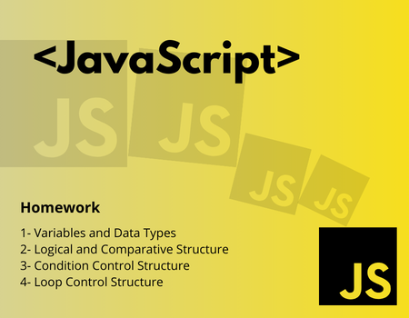
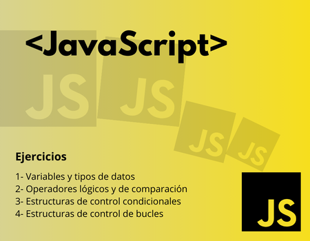

# 🚀 JavaScript Beginner Exercises 🚀

## English 🇺🇸

Welcome to the JavaScript Beginner Exercises repository! 🎉 This collection is designed to help beginners practice and master fundamental JavaScript concepts. The exercises cover topics such as variables, data types, logical operators, and comparisons. Each exercise comes with a brief description and example solutions.

### Table of Contents 📚

1. [Variables and Data Types](Exercises_in_English/ENG_variables_and_data_types.js)
2. [Logical Operators and Comparisons](Exercises_in_English/ENG_logical_operators_and_comparisons.js)
3. [Condition Control Structure](Exercises_in_English/ENG_conditionalStructures.js)
4. [Loop Control Structure](Exercises_in_English/ENG_bucles_control.js)

## Exercise File 📂

Description: This file contains a collection of JavaScript exercises for beginners, covering topics such as variables, data types, logical operators, and comparisons.

### How to View the Exercise File

1. Click on the link to the 📂 file.
2. Once on the file page, click the "Download" button to get a local copy.
3. Open the file using your preferred code editor to view and work on the exercises.

Feel free to explore the file and start practicing! Happy coding! 🚀

## Español 🇪🇸

¡Bienvenido al repositorio de Ejercicios para Principiantes en JavaScript! 🎉 Esta colección está diseñada para ayudar a principiantes a practicar y dominar conceptos fundamentales de JavaScript. Los ejercicios abarcan temas como variables, tipos de datos, operadores lógicos y comparaciones. Cada ejercicio incluye una breve descripción y soluciones de ejemplo.

### Tabla de Contenidos 📚

1. [Variables y Tipos de Datos](Ejercicios_en_Espanol/variables_and_data_types.js)
2. [Operadores Lógicos y de Comparación](Ejercicios_en_Espanol/logical_operators_and_comparisons.js)
3. [Estructura de control de condicionales](Ejercicios_en_Espanol/conditionalStructures.js)
4. [Estructura de control de bucles](Ejercicios_en_Espanol/bucles_control.js)

## Archivo de Ejercicios 📂

Descripción: Este archivo contiene una colección de ejercicios de JavaScript para principiantes, abordando temas como variables, tipos de datos, operadores lógicos y comparaciones.

### Cómo ver el Archivo de Ejercicios

1. Haz clic en el enlace al archivo.
2. Una vez en la página del archivo, haz clic en el botón "Descargar" para obtener una copia local.
3. Abre el archivo con tu editor de código preferido para ver y trabajar en los ejercicios.

¡Siéntete libre de explorar el archivo y comenzar a practicar! ¡Feliz codificación! 🚀
